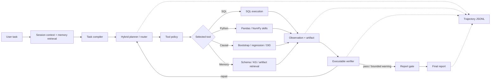

# SoloDeck Verifiable Data Agent Architecture

## Scope

SoloDeck is presented as a **verifiable data agent**, not as a trained RL system. It executes data-analysis tools, verifies numerical claims, stores trajectories and exposes a stable routing interface for future classifier, small-LM or RL policies.

## Main call chain



## Runtime audit: what is actually online

- `/api/v4/chat` calls `solodeck_v4.runtime.runner.run_v4_agent`. This is the current product path. It uses an explicit imperative tool loop with bounded Critic repair, which makes latency and failure handling straightforward.
- `/api/v3-agent` calls `solodeck_v3.workflows.data_agent_graph.run_v3_data_agent`. This path invokes a LangGraph `StateGraph` when LangGraph is installed and uses the same node order as a deterministic fallback otherwise.
- `solodeck_v4.workflows.state_graph.run_industrial_graph` is a runnable LangGraph implementation of the v4 flow, but it is **not currently the default `/api/v4/chat` entrypoint**.

Therefore the accurate interview statement is: SoloDeck contains a production v3 LangGraph workflow and a v4 state-graph implementation; the current conversational API uses a bounded explicit runner over the same Skills and Verifiers. It should not be described as if every v4 request necessarily traverses LangGraph.

## Concrete implementation

| Stage | Current implementation | LLM boundary |
|---|---|---|
| Session and memory | `solodeck_v4/session`, `context`, `retrieval` | Retrieval is deterministic; text interpretation may use an LLM fallback |
| Compiler | `solodeck_v4/compiler/enhanced_compiler.py` | Rules/schema first, guarded semantic route second |
| Planner/router | `solodeck_v4/routing/hybrid_router.py`, `planning/task_planner.py` | L1 rules, L2 TF-IDF/optional embeddings, guarded L3 LLM JSON |
| Tool policy | `solodeck_v4/tools/registry.py` | Deterministic contracts, permissions, timeout and retry metadata |
| Execution | `solodeck_v3/runtime/skill_runtime.py` | Python Skills execute calculations; LLM does not calculate ATE/CATE |
| Critic and retry | `solodeck_v4/critics/structured_critic.py`, `runtime/runner.py` | Structured scores and repair directives; maximum two repairs |
| Claim gate | `solodeck_v4/governance`, `solodeck_runtime/verifier.py` | Deterministic checks restrict claim strength |
| Trajectory | `solodeck_eval/trajectory.py` | JSONL output for later SFT/RL; no training claim |

## Agent roles

- **Planner** compiles the user goal into a task specification and tool sequence.
- **Executor** dispatches contract-bound tools and produces Python/SQL artifacts.
- **Critic** scores grounding, route quality, statistical validity, causal validity, uncertainty, privacy and traceability.
- **Report** can polish language, but every reported number must trace back to an executable artifact.

## Tool-router experiment interface

`solodeck_eval.router.route_tool(state, policy=None)` exposes the action space:

```text
{sql, python, plot, causal, search, memory, finish}
```

The default is a deterministic policy. Passing a callable replaces it with a classifier, small LM or RL policy without changing the executor or verifier.

## Trajectory data

Each JSONL step includes task/step IDs, bounded context, available and selected tools, arguments, observation, status, latency, token usage, intermediate reward and final reward. Unknown token usage is recorded as zero with `measured=false`; it is never fabricated.
