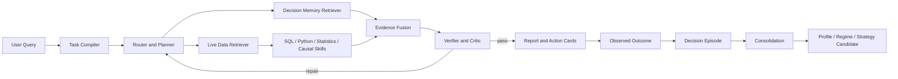

# SoloDeck

**A stateful, verifiable data agent for evidence-grounded business decisions.**

SoloDeck 面向内容创作者、一人公司和小型经营团队。系统将自然语言分析目标编译为可执行的数据任务，调用结构化查询、Python、统计分析和因果分析 Skill，验证中间产物，并在多轮会话中保存可追溯的分析状态与长期决策记忆。

SoloDeck 的核心定位是 **Memory-Grounded Causal Decision Agent**，不是由大模型直接生成数字的聊天机器人，也不是只展示指标的通用仪表盘。

## Design Principles

- **Live data first**：当前指标必须通过 DataFrame、SQL 或文件查询计算，Memory 不能替代实时数据。
- **LLM and computation separation**：LLM 用于语义理解、任务规划与表达；数值由 Python Skill 计算。
- **Verification before reporting**：输出前检查执行状态、数值一致性、统计假设、证据等级和报告引用。
- **Stateful analysis**：对话、数据版本、分析产物和决策记录分别持久化，支持追问、补充数据和状态恢复。
- **Causal safety**：明确区分描述性观察、调整后估计和实验性证据。
- **Traceability**：任务、工具参数、Observation、延迟、Token 使用和过程奖励记录为 JSONL trajectory。

## Architecture



Primary runtime loop:

```text
discover -> inspect -> search -> read
-> plan -> execute -> verify -> repair -> remember
```

## Core Capabilities

### Data ingestion and discovery

- CSV, Excel, SQLite, ZIP, screenshots and unstructured text
- schema inspection, type inference, field mapping and data-quality checks
- progressive tool disclosure: the Planner reads compact tool manifests before loading full argument schemas
- account-scoped datasets and versioned incremental uploads

Structured tables are not embedded and queried as plain text. Numeric questions are grounded in pandas, read-only SQL or explicit statistical functions.

### Agent orchestration

The v4 runtime coordinates four logical roles:

- **Planner**: compiles the goal into a typed `TaskSpec`, selects evidence sources and creates an execution plan.
- **Executor**: invokes Data, Python, statistics, causal, graph and report Skills.
- **Critic**: checks tool failures, missing evidence, numerical consistency and unsupported claims; failed runs enter a bounded repair loop.
- **Reporter**: converts verified artifacts into concise answers and action cards without recalculating metrics.

LangGraph is used for graph-based orchestration when available. Node functions retain a deterministic execution path for lightweight environments and unit tests.

### Statistical and causal Skills

Implemented analysis components include:

- descriptive aggregation and ranking
- derived-rate validation
- paired differences
- difference in means and relative lift
- Bootstrap confidence intervals
- regression adjustment and fixed effects
- ATE and segmented CATE
- optional IPTW, DML, DID and causal-discovery adapters
- placebo, balance and subsample stability checks

Candidate causal graphs combine temporal constraints, domain graph constraints and optional discovery backends. They represent hypotheses for validation, not automatic causal proof.

### Knowledge and retrieval

Retrieval is query-conditioned rather than a universal vector top-k call:

- schema retrieval for field and metric questions
- artifact retrieval for prior computed results
- session retrieval for references such as “继续看刚才的结果”
- knowledge-graph retrieval for entity relationships
- text retrieval for feedback and notes
- decision-memory retrieval for historical strategies, outcomes and business regimes

The retrieval layer can use lexical, context and optional embedding signals. Exact platform, topic, content format, metric and time constraints remain first-class filters.

## Hierarchical Temporal Decision Memory

Long-term Decision Memory stores what was decided, under which business conditions, from which evidence, and what happened afterward.

```text
Decision Episode
  -> Atomic Facts
  -> Strategy Evidence
  -> Consolidation
  -> Creator Profile / Business Regime
  -> Strategy Skill Candidate
```

Memory types:

- `DecisionEpisode`: decision context, source data, metrics, methods, recommendation and outcome
- `DecisionFact`: precisely queryable facts with validity intervals and source lineage
- `BusinessRegime`: time-bounded business patterns; a new active regime historizes the prior one
- `CreatorProfile`: evidence-aggregated strengths, effective formats/topics and weak-evidence areas
- `StrategyEvidence`: before/after metrics, outcome and causal evidence level
- `StrategySkillCandidate`: repeated patterns awaiting verification and human approval
- `MemoryQueryPlan`: selects profile, regime, similar episodes, strategy evidence and required live-data fields
- `DecisionMemoryContext`: a retrieval artifact consumed by the analysis Agent, never a final answer

Episode retrieval uses a transparent ranking function:

```text
score = 0.35 * semantic_similarity
      + 0.30 * context_match
      + 0.15 * recency
      + 0.20 * outcome_relevance
```

Context matching considers platform, topic, account stage, content format and metric. Embeddings are optional and never the only retrieval key.

### Evidence governance

Decision evidence has three levels:

```text
observational -> adjusted -> experimental
```

Repeated observational success may create a strategy candidate, but it cannot produce causal wording. Promotion into the executable Skill library requires sufficient evidence, verifier approval and human approval.

### Storage schema

The first storage backend is SQLite behind a storage interface designed for PostgreSQL-compatible migration. It creates:

```text
decision_episodes
decision_facts
business_regimes
creator_profiles
strategy_evidence
strategy_skill_candidates
```

Indexes cover project, timestamp, platform, topic, content format, status and validity periods. Account workspaces provide the project isolation boundary.

## Conversation and Account Model

```text
user -> workspace -> datasets -> conversation threads -> messages and runs
```

- opaque session tokens are hashed in the authentication database
- browser sessions use `HttpOnly` and `SameSite=Lax` cookies
- authenticated workspace IDs are derived on the server and cannot be overridden by request payloads
- new accounts start with empty workspaces
- one conversation can receive multiple data revisions while retaining its semantic history
- new data invalidates computed artifact caches before the next analysis
- persisted assistant messages contain display-safe artifacts rather than raw uploaded rows

Anonymous local workspaces remain available. Cross-device history requires an account.

## Repository Layout

```text
src/                              React SPA
solo_creator_agent/api_spa.py     FastAPI entry point
solodeck_runtime/                 data sources, tools, persistence and verifier
solodeck_v3/                      typed compiler, Skills, graph, validation and reward
solodeck_v4/                      conversational runtime and orchestration
solodeck_v4/decision_memory/      hierarchical temporal Decision Memory
solodeck_eval/                    trajectory and evaluation utilities
solodeck_bench/                   reproducible benchmark tasks
tests/                            offline test suite
functions/api/                    Cloudflare Pages API proxy
```

## Quick Start

Requirements:

- Python 3.10+
- Node.js 20+

Install dependencies:

```bash
git clone <repository-url>
cd Solodeck.cn

python -m venv .venv
source .venv/bin/activate
pip install -r solo_creator_agent/requirements.txt

npm ci
```

Start the API and SPA together:

```bash
npm run dev
```

Default endpoints:

```text
Frontend  http://localhost:5173
API       http://localhost:8787
Health    http://localhost:8787/api/health
```

Build the frontend:

```bash
npm run build
```

The production frontend is written to `dist/`.

## Configuration

Copy the example configuration and replace placeholders locally:

```bash
cp solo_creator_agent/.env.example .env
```

Relevant variables:

```env
OPENAI_BASE_URL=https://your-openai-compatible-endpoint/v1
OPENAI_API_KEY_BASIC=replace-with-basic-key
OPENAI_MODEL_BASIC=your-basic-model
OPENAI_API_KEY_ADVANCED=replace-with-advanced-key
OPENAI_MODEL_ADVANCED=your-advanced-model

SOLODECK_AUTH_DB=/absolute/path/to/solodeck_auth.db
SOLODECK_LANGFUSE_ENABLED=false
SOLODECK_LANGFUSE_CAPTURE_CONTENT=false
```

LLM configuration is optional for deterministic data and statistical Skills. Vision extraction and natural-language polishing require a compatible model.

Never commit `.env`, API keys, Tunnel credentials, authentication databases or uploaded user data. The repository `.gitignore` excludes these files.

## API Surface

Main endpoints:

```text
POST /api/upload
POST /api/data-agent/query
GET  /api/data-agent/threads
GET  /api/data-agent/threads/{thread_id}
GET  /api/data-agent/runs

POST /api/auth/register
POST /api/auth/login
GET  /api/auth/me
POST /api/auth/logout

GET  /api/v4/decision-memory/context
POST /api/v4/decision-memory/outcomes
POST /api/v4/decision-memory/consolidate
```

The Decision Memory service can also be used directly:

```python
from solodeck_v4.decision_memory import DecisionMemoryService

memory = DecisionMemoryService()
memory.record_decision(analysis_state, user_id="user_1", project_id="workspace_1")
context = memory.get_decision_context(
    "为什么最近收藏率下降？",
    project_id="workspace_1",
)
summary = memory.run_consolidation("workspace_1", window_days=365)
```

## Reproducible Decision Memory Example

The offline example writes five XHS Agent-content episodes, consolidates repeated evidence and checks causal wording policy:

```bash
python scripts/decision_memory_example.py
```

Expected properties:

- five episodes are persisted
- repeated question-title observations form a profile and strategy candidate
- evidence level remains `observational`
- `can_claim_causality` remains `false`
- the query planner requests recent and previous save rate, topic mix, format mix and posting frequency from the live-data layer

## Tests

Run the complete offline suite:

```bash
pytest -q
```

The suite covers data discovery, routing, statistical Skills, verifier behavior, account isolation, persistent conversations, incremental data revisions, Decision Memory retrieval, temporal regimes, consolidation and causal-safety gates.

Run the data-agent benchmark:

```bash
python solodeck_bench/run_benchmark.py
```

Trajectory records follow the schema in `solodeck_eval/trajectory_schema.json` and are suitable for later supervised fine-tuning or policy-learning experiments. The repository does not claim that a production RL policy has already been trained.

## Deployment

The repository includes:

- Cloudflare Pages proxy under `functions/api/`
- Render configuration in `render.yaml`
- systemd, Nginx and Cloudflare Tunnel examples under `solo_creator_agent/deploy/`
- deployment notes in `DEPLOYMENT_SOLODECK_CN.md`

Deploy the SPA and FastAPI service independently. Configure `SOLODECK_API_ORIGIN` in Cloudflare Pages so `/api/*` requests are forwarded to the API origin.

## Current Boundaries

- causal discovery produces candidate graphs that still require statistical or experimental validation
- Decision Memory consolidation is deterministic and threshold-based; learned consolidation policies are not included
- strategy candidates do not automatically enter the executable Skill library
- SQLite is the default local backend; high-concurrency deployments should provide a PostgreSQL backend
- optional causal-discovery libraries are not required by the lightweight installation
- screenshot extraction depends on the configured vision model

## Technical Documentation

- [Agent architecture](ARCHITECTURE_AGENT.md)
- [System design](SYSTEM_DESIGN.md)
- [Evaluation protocol](EVAL_PROTOCOL.md)
- [Causal module](CAUSAL_MODULE.md)
- [Decision Memory](docs/DECISION_MEMORY.md)
- [Agent RL preparation](AGENT_RL_MODULE.md)
- [Deployment](DEPLOYMENT_SOLODECK_CN.md)
