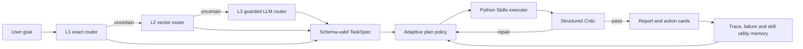

# SoloDeck Agent Routing, Critic and Runtime Evolution

## 1. Agent loop



## 2. Three-level routing

- L1 uses high-precision business markers. It is cheap, deterministic and auditable.
- L2 retrieves the nearest task exemplars. It optionally uses a multilingual
  SentenceTransformer; the no-download fallback is character n-gram TF-IDF vector retrieval.
- L3 calls the advanced LLM only when L1 and L2 are uncertain. It receives column
  names rather than uploaded rows and must return guarded JSON. Unknown task types
  and hallucinated columns are rejected.

Environment switches:

```text
SOLODECK_ENABLE_LLM_ROUTER=true
SOLODECK_USE_SENTENCE_TRANSFORMERS=false
SOLODECK_ROUTER_EMBEDDING_MODEL=paraphrase-multilingual-MiniLM-L12-v2
```

## 3. Structured Critic

The Critic scores nine dimensions: task grounding, route confidence, artifact
integrity, statistical validity, causal validity, uncertainty handling,
actionability, privacy and traceability. It returns `pass`, `repair` or `block`,
plus typed failures and executable repair directives.

The Critic runs before writing and after action-card generation. A repair outcome
can select an alternative plan and rerun analysis, validation and composition for
at most two revisions.

## 4. DAPO-inspired policy update

SoloDeck does not implement token-level DAPO or update LLM weights. It borrows two
runtime-policy ideas:

1. Dynamic sampling: saturated trajectories are skipped; mixed-quality or failed
   traces are retained as informative training signals.
2. Asymmetric clipping: plan-utility updates clip positive and negative changes
   separately to avoid abrupt scheduler changes.

Plan selection uses stored utility, an exploration bonus and a cost penalty:

```text
score(plan) = utility + 0.08 * sqrt(log(total + 2) / (count + 1)) - cost_penalty
```

The update is validation gated and stored in SQLite `skill` memory. It changes
future workflow selection, not model parameters or Python source code.

## 5. Trace fields

API responses expose developer-safe metadata without raw uploaded rows:

```text
semantic_route
critic_report
plan_policy_decision
plan_utility_update
tool_calls
trace
```
