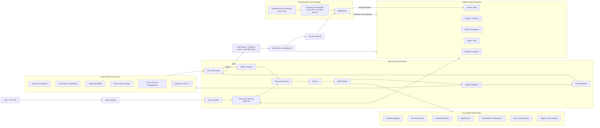

# SoloDeck Industrial Data Agent Runtime

SoloDeck is a stateful, auditable and recoverable Data Agent Runtime. It keeps v3 deterministic analysis skills and v4 conversational orchestration, while adding unified memory, evidence lineage, causal claim governance, replayable checkpoints, synthetic SCM benchmarks and validation-gated skill evolution.

## Architecture



## Memory is not raw vector RAG

Each memory item has a stable ID, scope, source, lineage, privacy level, quality score, warnings, version and retention policy. The first backend is SQLite behind `MemoryBackend`; PostgreSQL, pgvector, Neo4j, Redis or object storage can replace it without changing the runtime API.

Memory types:

- working, session
- dataset, schema
- artifact, evaluation
- graph, text
- failure, skill

The runtime retrieves evidence by task intent. Metric questions prioritize executable artifacts; relationship questions use graph memory; causal questions require graph, calculation artifacts and causal-readiness evidence; planning questions use prior failures, skill utility and artifacts.

## Evidence and lineage

Every evidence object can carry `source_id`, `artifact_id`, `skill_id`, `validator_id` and `dataset_version`. Statistical artifacts are registered centrally by the Skill Runtime so lineage cannot be silently lost through duplicate state writes.

Rules enforced by governance:

- Numerical claims require a Python or SQL artifact.
- Causal-looking claims require treatment, outcome, unit, time and causal-readiness evidence.
- Missing comparison groups downgrade the output to a descriptive pattern.
- A 95% interval crossing zero blocks strong improvement claims.
- Weak evidence produces a low-cost validation plan instead of a rollout instruction.
- Observational estimates are never labeled as experimental evidence.

## Evidence levels

1. Descriptive pattern
2. Adjusted association
3. Exploratory causal hypothesis
4. Quasi-causal estimate
5. Experimental evidence

The knowledge graph is a structured memory and constraint source. The candidate DAG is always named an **exploratory causal hypothesis graph**. It can suggest confounders, enforce temporal directions and organize assumptions, but it is never treated as causal ground truth.

## Validation without a true DAG

For real user data, SoloDeck checks claim eligibility rather than pretending to know causal truth. Validators cover schema, estimand, readiness, estimator validity, uncertainty, graph plausibility, claim grounding, action safety, privacy, trace completeness and post-writing consistency.

For development, synthetic SCM tasks provide known DAGs and ATE values. They measure extraction accuracy, confounder recall, DAG edge precision/recall, ATE error, causal-overclaim rate, evidence-level classification and action safety. Synthetic scores are never presented as proof on real user datasets.

## Skill evolution without model training

SkillOpt-lite only edits compact external skill artifacts such as routing rules, evidence packing, estimator selection and report gates. A proposed patch must improve a held-out validation score before acceptance. Rejected patches are retained as negative feedback. Base-model weights are never changed online.

## Checkpointing and replay

The runtime saves redacted state checkpoints around input, compilation, planning, each tool call, post-writer governance and memory update. Replay endpoints expose operational state without uploaded dataframe rows or raw private text.

Relevant endpoints:

- `POST /api/v4/chat`
- `GET /api/v4/trace/{trace_id}/checkpoints`
- `GET /api/v4/trace/{trace_id}/replay`
- `GET /api/v4/memory/trace`

## Difference from adjacent systems

| System | Main output | SoloDeck difference |
|---|---|---|
| BI dashboard | Charts and historical summaries | Produces validation-gated next actions |
| Pure RAG | Retrieved text and generated answer | Routes to typed evidence and executable artifacts |
| Pure LangGraph | Workflow control | Adds memory schema, statistical skills, governance and benchmarks |
| Pure LLM planner | Natural-language plan | Requires deterministic execution and claim-level validation |

## Code map

- Unified memory: `solodeck_v4/memory/`
- Evidence objects: `solodeck_v4/evidence/`
- Task-aware retrieval: `solodeck_v4/retrieval/`
- Claim governance: `solodeck_v4/governance/`
- Checkpoint/replay: `solodeck_v4/runtime/checkpoint.py`
- Industrial state adapter: `solodeck_v4/workflows/industrial_runtime.py`
- Production LangGraph state flow: `solodeck_v4/workflows/state_graph.py`
- SkillOpt-lite: `solodeck_v4/evolution/skillopt.py`
- Synthetic SCM benchmark: `solodeck_v4/bench/synthetic_scm.py`
- Deterministic skills: `solodeck_v3/skills/`
- LangGraph workflow: `solodeck_v3/workflows/data_agent_graph.py`

## Verification

```bash
/workspace/ylj/miniconda3/envs/py310/bin/python -m unittest discover -s tests -v
```
