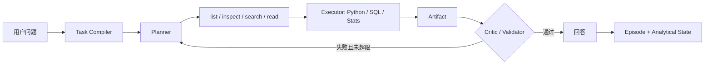

# Core Code I Must Understand Before Interview



生产对话链由 `solodeck_v4/workflows/state_graph.py::build_industrial_graph` 使用 LangGraph 条件边控制；本文件聚焦的 `InterviewDataAgent` 是可独立单测的确定性数据获取与工具执行内核。两者不是两套产品：LangGraph 管状态与重试，Data Agent 内核负责真实数据操作。

## 1. Agent State

- 路径：`solodeck_runtime/models.py`
- 核心：`TaskSpec`、`PlanStep`、`AgentState`
- 输入：自然语言目标、数据源与约束。
- 输出：显式任务、步骤状态、观察、工件、批评和修订次数。
- 原因：聊天记录只描述“说过什么”，结构化状态才能准确恢复“算到哪一步、用了什么数据、产物是否通过”。
- 下游：Planner 生成 `PlanStep`，Executor 原位更新状态，Critic 写入 `critique`。

面试问：为什么不只把历史对话塞回 LLM？

答：对话无法可靠恢复过滤条件、字段版本、工件血缘和执行状态；显式状态可验证、可快照，也能限制重试次数。

## 2. Unified Source Adapter

- 路径：`solodeck_runtime/sources.py`
- 核心：`SourceAdapter`、`DataFrameSourceAdapter`、`FileSourceAdapter`
- 接口：`list_sources`、`inspect_source`、`search_source`、`read_source`。
- CSV/Excel：pandas 读取后按列和过滤条件检索。
- SQLite：检查表结构并只允许 `SELECT/WITH`。
- TXT/Markdown：词法检索并返回精确行号。
- 原因：Planner 面对的是稳定操作，不需要知道每种存储格式的细节。
- 下游：Tool Registry 将统一接口暴露成 Function Calling 工具。

面试问：为什么表格不先切块做向量检索？

答：字段、过滤、聚合和连接都有精确语义；向量相似度不能保证数值完整性，结构化操作更准确且成本更低。

## 3. Tool Registry and JIT Loading

- 路径：`solodeck_runtime/tools.py`
- 核心：`ToolManifest`、`ToolDefinition`、`DataToolRegistry`
- 输入：Planner 选择的工具名与参数。
- 输出：状态、耗时、观察摘要和计算结果。
- 机制：`manifests()` 只暴露名称、短说明、数据源类型和风险；`load()` 在选中后才返回完整参数和约束；`call()` 捕获异常形成 observation。
- 原因：减少一次性塞给模型的工具 Schema，降低 token 和错误选参概率。
- 下游：Executor 调用工具，Critic 检查结果。

面试问：JIT 工具加载节省了什么？

答：第一阶段只路由短 manifest，选定后才加载完整 Schema，因此上下文更短，工具越多时收益越明显。

## 4. Source-Specific Search

- 路径：`solodeck_runtime/sources.py`
- 核心：`FileSourceAdapter.search_source`、`_filter_frame`、`_search_text`
- 输入：source_id 与结构化过滤或文本 query。
- 输出：选中字段/记录计数，或带行号的词法命中。
- 分发：CSV/Excel 走 pandas，SQLite 走 SQL，文本走 lexical/BM25 思路。
- 安全：SQLite 拒绝非只读语句；文件必须位于配置根目录。
- 下游：读取最小结果后交给 `run_python` 或 `run_sql`。

面试问：语义检索何时启用？

答：只在文本词法检索召回不足时作为可选回退，不把它用于数值表格的主检索。

## 5. Planner–Executor–Critic Loop

- 路径：`solodeck_runtime/data_agent.py`
- 核心：`InterviewDataAgent.compile`、`plan`、`run`
- 输入：问题、当前 DataFrame、dataset/session 标识。
- 输出：TaskSpec、六步计划、每步 tool trace、Critic 结论和 memory_id。
- 流程：discover → inspect → search → read → run_python → validate_result。
- 分工：Planner 只产生类型化步骤；Executor 只调用工具；Critic 只验证工件，不让三个角色自由聊天。
- 下游：API 将轨迹和已有 v3/v4 分析答案一起返回 SPA。

面试问：这里为什么算多 Agent？

答：它是三个逻辑角色共享结构化状态，不是三个无限对话的模型实例；角色边界由输入输出合同和状态迁移体现。

## 6. Memory Retrieval

- 路径：`solodeck_v4/memory/store.py`
- 核心：`UnifiedMemory.retrieve_memory`、`compact_memory`
- 输入：query 与 project/session/task/source 元数据过滤。
- 输出：按 `0.65 relevance + 0.20 recency + 0.15 importance` 排序的记忆。
- relevance：词法重叠；recency：30 天指数衰减；importance：quality_score。
- 说明：权重是透明工程启发式，不声称经过训练。
- 压缩：旧原始轨迹被摘要为 session memory，避免长期记忆无限增长。

面试问：为什么不用纯 embedding memory？

答：数据集 ID、任务类型和状态 ID 应先精确过滤；embedding 只适合补充语义相似，不适合覆盖权限和版本约束。

## 7. Critic and Silent Error Validation

- 路径：`solodeck_runtime/verifier.py`、`solodeck_runtime/repair_demos.py`
- 核心：`ActiveVerifier.inspect_join`、`inspect_rate`、`silent_join_repair_demo`
- 输入：连接前两表、连接键、实际结果或比率分子分母。
- 输出：valid、issues、warnings、重复率与行膨胀探针。
- 关键点：SQL/Python 成功不代表分析正确；多对多连接会静默重复金额。
- 修复：两侧先按业务键聚合或去重，再连接并重新运行探针。

面试问：Critic 是否一定调用 LLM？

答：不一定。字段、分母、连接基数、数值一致性应由确定性代码检查，只有业务语义冲突才交给 LLM。

## 8. API and Frontend Trace

- 路径：`solo_creator_agent/api_spa.py` 的 `data_agent_query`；`src/main.jsx` 的 `RunInspector`
- 输入：workspace_id、dataset_id、session_id、message。
- 输出：回答、结果视图、TaskSpec、计划、工具轨迹、验证和状态 ID。
- 隐私：前端轨迹只有字段、工具和摘要，不返回原始上传行；F12 使用 `window.__SOLODECK_AGENT_RUN__` 检查脱敏轨迹。
- 下游：运行记录存入 workspace SQLite，后续问题复用 session 和 analytical state。

面试问：如何证明回答真的来自工具？

答：每次工具调用都有参数、状态、耗时和 observation，最终结果绑定计算工件与 validator；不是只显示一段 LLM 文本。

# One Real Demo Trajectory

任务：`Which content types improved favorites rate the most in August?`

```text
Compile: group_by=content_type, numerator=favorites, denominator=views, month=8
Plan: list_sources -> inspect_source -> search_source -> read_source
      -> run_python(rate) -> validate_result
Observation: 找到当前数据源；识别日期、内容类型、收藏、播放字段
Artifact: 按内容类型计算 SUM(favorites) / SUM(views) 并排序
Critic: 检查空结果和零分母，通过后允许回答
Memory: 写入 episode，只保留任务、工具序列、状态和校验摘要
```

# 20 Likely Interview Questions

1. Task Compiler 为什么采用规则优先？短答：明显字段和指标无需消耗 LLM。深入：复杂语义才走结构化 LLM 回退。位置：`data_agent.py::compile`。
2. Planner 输出为什么类型化？短答：可执行、可校验。深入：每步含目标、操作、数据源、期望输出和状态。位置：`models.py::PlanStep`。
3. Function Calling 如何落地？短答：registry 校验工具名并统一返回 observation。位置：`tools.py::call`。
4. 什么是 JIT Tool Loading？短答：先 manifest，选中后加载完整 Schema。位置：`tools.py::manifests/load`。
5. Executor 做什么？短答：只执行计划中的工具并登记工件。位置：`data_agent.py::run`。
6. Critic 做什么？短答：检查分析正确性而非文案风格。位置：`verifier.py`。
7. 如何发现多对多连接错误？短答：检查两侧键重复率和连接后行数膨胀。位置：`inspect_join`。
8. 为什么执行成功仍可能错误？短答：SQL 可运行但重复连接会放大金额。位置：`silent_join_repair_demo`。
9. CSV 如何检索？短答：按字段和条件执行 pandas 过滤。位置：`sources.py::_filter_frame`。
10. SQLite 如何防止写操作？短答：只接受 SELECT/WITH。位置：`FileSourceAdapter.search_source`。
11. 文本如何检索？短答：词法行级搜索，已有 runtime 另含 BM25。位置：`sources.py::_search_text`、`retrieval.py::TextRetriever`。
12. 为什么不向量化全部 CSV？短答：相似度不能替代精确过滤和聚合。位置：`INTERVIEW_REFACTOR_AUDIT.md`。
13. Memory 有哪几类？短答：working、analytical、episode、failure。位置：`models.py::AgentState/AnalysisState`、`memory/models.py`。
14. Memory 如何排序？短答：相关性、时间和质量的显式加权。位置：`memory/store.py::retrieve_memory`。
15. 权重是否学习得到？短答：不是，是工程启发式。深入：保持可解释，未来用 benchmark 调参。位置同上。
16. 如何恢复分析状态？短答：SQLite 保存 AnalysisState，可 snapshot/restore。位置：`persistence.py::StateStore`。
17. LangGraph 的作用是什么？短答：控制状态迁移和条件重试，不负责计算。位置：`solodeck_v4/workflows/state_graph.py`。
18. 因果分析何时运行？短答：只有明确因果、净增量、控制混杂等问题。位置：`risk_router.py`、`method_planner.py`。
19. 如何记录可训练轨迹？短答：JSONL 记录 step、工具、参数、observation、延迟和 reward。位置：`solodeck_eval/trajectory.py`。
20. 是否已经完成 Agent RL？短答：没有。当前完成轨迹、verifier 和 baseline，RL 训练是未来工作。位置：`EVAL_PROTOCOL.md`。
