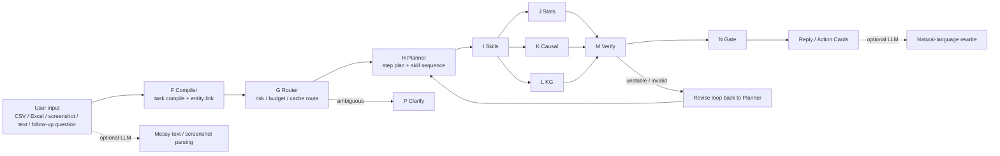

# SoloDeck LLM Boundary Map

## One-line summary

SoloDeck is not an "LLM does everything" system. It uses:

- deterministic code for compilation, routing, statistics, causal estimation, verification, and memory updates
- optional LLM calls for semantic understanding of messy input, variable interpretation, and final natural-language expression

## Interview-safe architecture view

## What is LLM vs deterministic

| Module | Current implementation | LLM? | Notes |
|---|---|---:|---|
| F Compiler | rules + entity linking | Mostly no | Decides task type, treatment, outcome, budget hints |
| G Router | rules | No | Decides fast path / deep path / clarify / cache reuse |
| H Planner | rules + plan templates | No | Turns task into tool sequence |
| I Skills registry | code dispatch | No | Calls Python skills in order |
| J Stats | numpy / sklearn / pandas | No | KPI, naive effect, bootstrap CI, regression, IPTW |
| K Causal | causal libs + rule fallback | No | candidate DAG, readiness, fixed effect, DID |
| L KG | structured graph build + text token extraction | Mostly no | Graph is built programmatically from schema and text tokens |
| M Verify | validators | No | artifact/statistical/causal/privacy/trace checks |
| N Gate | post-writer gate | No | Blocks or downgrades risky output |
| P Clarify | template-based question | No | Asks for missing entity/platform/metric |
| Input understanding | screenshot/text extraction | Yes | Multimodal LLM extracts records/tasks |
| Variable semantics | optional variable mapping | Optional | LLM can label treatment/outcome/confounder roles |
| Final wording | reply polish / advice / report polish | Optional | LLM rewrites result into user-friendly language |

## Code-grounded mapping

### 1. Deterministic core

- Compiler:
  - `solodeck_v3/compiler/task_compiler.py`
  - `solodeck_v4/compiler/enhanced_compiler.py`
- Router:
  - `solodeck_v3/router/router.py`
  - `solodeck_v3/router/budget_router.py`
  - `solodeck_v4/risk/risk_router.py`
- Planner:
  - `solodeck_v4/planning/task_planner.py`
  - `solodeck_v3/planning/method_planner.py`
- Session memory and compression:
  - `solodeck_v4/session/store.py`
  - `solodeck_v4/context/compressor.py`
- Verification and gate:
  - `solodeck_v3/verification/__init__.py`
  - `solodeck_v4/verification/post_writer.py`

### 2. Deterministic stats / causal / KG

- Effect estimation:
  - `solo_creator_agent/src/skills.py`
  - `EffectEstimationSkill.bootstrap_ci()`
  - `EffectEstimationSkill.fixed_effect()`
  - `EffectEstimationSkill.iptw()`
- Candidate causal graph:
  - `solo_creator_agent/src/causal_discovery.py`
- KG construction:
  - `solodeck_v3/graph/kg_builder.py`
- Entity linker:
  - `solodeck_v3/nlp/entity_linker.py`

### 3. Optional LLM layer

- LLM gateway:
  - `solo_creator_agent/src/llm_agent.py`
- Screenshot / text to structured records:
  - `extract_records_from_uploads()`
- Variable semantics:
  - `solo_creator_agent/src/variable_mapper.py`
- Final conversational reply:
  - `solodeck_v4/runtime/runner.py`
  - `_try_llm_reply()`

## Module-by-module explanation

### F. Compiler

Current status: **mostly deterministic**

What it does:

- reads the user question
- matches keywords to task type
- ranks candidate treatment and outcome columns
- merges current message with session context in follow-up turns

Why this is not mainly LLM:

- the mapping logic is hard-coded with keyword priorities and column ranking
- entity reuse comes from alias rules and session memory, not free-form generation

LLM participation boundary:

- if the original input is a screenshot or pasted messy text, an upstream LLM may first convert it into rows
- once the dataframe exists, the compiler itself is mostly rule-based

### G. Router

Current status: **deterministic**

What it does:

- decides whether a question is high-risk causal
- decides whether to reuse cache
- decides whether the system should ask a clarification question
- assigns fast path vs deep path

Why it is deterministic:

- implemented with keyword triggers, prior linked entities, and budget policy
- no generation, no hidden reasoning step

### H. Planner

Current status: **deterministic**

What it does:

- turns task spec and risk profile into a small tool plan
- chooses which skills run next

Why it is deterministic:

- step templates and skill combinations are defined in Python
- this keeps the pipeline reproducible and cheap

### I. Skills

Current status: **mixed as a container, mostly deterministic in execution**

The registry itself is deterministic. The interesting question is whether each skill internally uses an LLM.

### J. Stats

Current status: **deterministic**

Includes:

- KPI computation
- naive difference in means
- relative lift
- bootstrap confidence interval
- fixed effect regression
- IPTW when feasible

This is all numeric code, mainly in `solo_creator_agent/src/skills.py`.

### K. Causal

Current status: **deterministic / statistical**

Includes:

- causal readiness checks
- candidate DAG generation
- bootstrap interval stability
- regression adjustment
- DID in v3 skill chain

Important interview line:

> SoloDeck does not let the LLM directly output causal conclusions. The LLM may help describe a question, but causal estimation itself is done by statistical code.

### L. KG

Current status: **mostly deterministic**

What it does:

- creates nodes from schema columns and dataset structure
- creates edges such as `may_affect` and `may_confound`
- extracts simple text entities from uploaded text

Current implementation is not a pure LLM-built knowledge graph.

LLM participation boundary:

- if future versions add NER/relation extraction from long documents, that can use LLM
- in the current version, the KG is mainly schema-driven and rule-driven

### M. Verify

Current status: **deterministic**

Checks:

- artifact completeness
- statistical consistency
- causal claim safety
- privacy
- trace completeness
- output format

Why this matters:

- this is the layer that stops the system from turning weak evidence into overconfident business advice

### N. Gate

Current status: **deterministic**

Post-writer gate checks whether:

- numbers shown to the user are backed by artifacts
- the report contains over-strong causal wording
- the action cards are executable

This is a classic safety/reliability gate, not an LLM generation step.

### P. Clarify

Current status: **deterministic**

When the entity linker cannot resolve "that one", "that platform", or "this article", the system asks a structured clarification question.

Right now this is template-driven.

## The practical boundary line

The easiest way to explain SoloDeck is:

> LLM is used at the fuzzy edges, not in the mathematical core.

Fuzzy edges:

- screenshot / messy text understanding
- variable semantic labeling
- final response phrasing

Mathematical core:

- task compilation after structured data exists
- routing
- planning
- KG construction
- effect estimation
- bootstrap CI
- fixed effects / IPTW / DID
- verification
- gating
- memory update

## A short interview version

> In SoloDeck, I deliberately separated semantic understanding from causal computation. LLM handles messy screenshots, text parsing, optional variable semantics, and final user-facing wording. But the compiler, router, planner, KG build, bootstrap CI, fixed-effect regression, IPTW, verification, and gate are deterministic Python modules. So the LLM helps us understand and explain, but it does not decide the causal answer itself.
