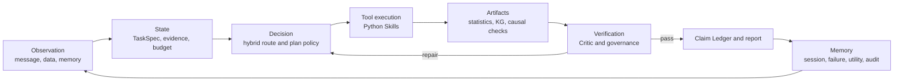

# SoloDeck: Evidence-Driven Data Agent Workflow

## Product definition

SoloDeck converts creator and one-person-company data into evidence-backed,
executable business actions. It is a stateful Data Agent workflow rather than a
collection of loosely coupled LLM roles.

## Runtime loop



## LLM boundary

| Component | Implementation | LLM role |
|---|---|---|
| L1 routing | deterministic markers | none |
| L2 routing | vector retrieval | none |
| L3 routing | guarded JSON TaskSpec | ambiguity only |
| Planning | templates + historical utility + UCB exploration | optional proposal only |
| Statistics | pandas, bootstrap, OLS, IPTW, DID | none |
| KG/DAG | schema rules, graph constraints, optional discovery libraries | optional hypothesis wording |
| Critic | deterministic dimensions and validators | none for release gates |
| Report | Claim Ledger + templates | optional language polishing |

The LLM may propose a task or wording. It cannot grant permissions, execute an
unregistered tool, create unsupported numbers or bypass verification.

## Tool contract

Every tool declares:

```text
name, description, permission, required state, required arguments,
required output, timeout budget, retryable errors, cost hint,
side effects and contract version
```

Each call writes a redacted audit row with call ID, latency, cost, status and error
semantics. Uploaded dataframe rows and free-form private text are not included.

## Evidence and claims

The runtime distinguishes retrieval evidence, calculation artifacts and user claims.
A `ClaimRecord` contains:

```text
claim text
claim type and evidence level
source artifact IDs
calculation method
confidence and limitations
applicable scope
```

Numeric claims must reference a non-writer Python/SQL artifact. Weak evidence cannot
support strong causal wording. Action cards must stay within the verified scope.

## Critic and repair

The Structured Critic scores task grounding, route confidence, artifact integrity,
statistical validity, causal validity, uncertainty handling, actionability, privacy
and traceability. It returns `pass`, `repair` or `block` with typed repair directives.

Repair excludes the failed plan when an alternative exists, reruns bounded Skills
and stops after at most two revisions.

## Memory

```text
working state      current graph state
session memory     dialogue turns and compressed context
artifact cache     reusable computed outputs
evaluation memory  critic and governance results
failure memory     typed failures and repair outcomes
skill memory       historical plan utility and accepted patches
audit memory       trace and tool-call lineage
```

Compressed summaries restore conversational context but never replace source
evidence. Planning questions retrieve failure, skill and artifact memory rather than
injecting the entire history into the prompt.

## Runtime evolution

SoloDeck does not train LLM weights online. Informative trajectories update workflow
plan utility after verification. Saturated traces are skipped; utility changes are
asymmetrically clipped. Candidate Skill patches require held-out improvement before
acceptance and are not automatically deployed.

## Evaluation

The Agent Eval reports route accuracy, TaskSpec validity, tool success, expected-tool
recall, Claim grounding, Critic agreement, safety agreement, latency and cost.
Synthetic SCM tests separately measure treatment/outcome extraction, confounder
recall, DAG precision/recall, ATE error and causal overclaim.

## Accurate positioning

Use this wording:

> SoloDeck is a stateful, evidence-driven Data Agent workflow with guarded semantic
> routing, deterministic analysis Skills, structured Critic repair, Claim governance
> and memory-guided plan selection.

Avoid claiming that it is a swarm, an online-trained RL system or an autonomous
causal-discovery oracle.
