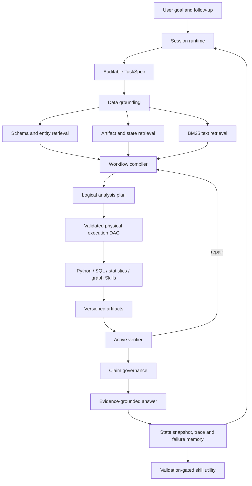

# SoloDeck: Stateful and Verifiable Data Agent Runtime

## One-sentence identity

SoloDeck is a stateful and verifiable Data Agent that grounds natural-language
analytical goals to heterogeneous data, compiles executable workflows, actively
verifies intermediate results, and preserves analytical state across long-running
interactions.

## Architecture



LangGraph remains an optional controller for node transitions. The durable
architecture is defined by TaskSpec, EvidenceObject, Workflow, Artifact and
AnalysisState protocols, so persistence and execution do not depend on LangGraph.

## Before and after

| Before | Current convergence |
|---|---|
| Creator dashboard plus loosely connected modules | General Data Agent runtime with creator analysis as one domain pack |
| Chat history treated as context | Explicit, versioned analytical states with parent and branch IDs |
| Planner emitted generic steps | Workflow compiler emits logical and physical typed DAGs |
| RAG described as the memory center | Source-aware grounding; embeddings are optional only for text |
| Results stored as unrelated dictionaries | Namespaced artifacts with dataset versions and lineage |
| Validators ran mostly after execution | Deterministic probes recompute rates and challenge joins |
| Causal analysis dominated positioning | Causal methods are guarded statistical Skills |

## Core protocols

### TaskSpec

The persisted TaskSpec records project/session/task scope, user goal, task type,
data sources, tables, columns, treatment, outcome, dimensions, time range, tools,
validation rules, ambiguity and clarification requirements. High-confidence cases
use deterministic compilation; the existing guarded LLM fallback may only return a
schema-valid proposal.

### EvidenceObject

Schema, graph, text, state and artifact retrieval all return EvidenceObjects with
source ID, dataset version, score, confidence, provenance, privacy scope, producer,
validator and warnings. A retrieved paragraph is evidence, not a computed number.

### AnalysisState

An AnalysisState stores selected data, filters, joins, derived variables,
hypotheses, assumptions, workflow, executed nodes, artifacts, evidence level and
conclusions. `snapshot`, `restore`, `branch`, `rollback`, `diff` and `merge` operate
on persisted state IDs. Natural-language rollback uses these snapshots rather than
reconstructing an old analysis from chat text.

### Artifact lineage

```text
dataset version
  -> schema / transformed dataset / metric artifact
  -> statistical estimate
  -> validation report
  -> final report
```

Every adapted legacy artifact is namespaced by `task_id`, preventing one task's
`bootstrap_ci` from replacing another task's result. Explicit input artifact IDs
are preserved. A final report additionally references all analytical artifacts it
summarizes.

## Data grounding and retrieval

The common retrieval contract is `retrieve(RetrievalQuery) -> EvidenceObject[]`.

| Retriever | Selection method |
|---|---|
| SchemaRetriever | project, dataset and version metadata |
| ArtifactRetriever | exact artifact ID/type/task plus lineage |
| StateRetriever | project, session, state and dataset version |
| GraphRetriever | persisted relation evidence; never causal truth |
| TextRetriever | local BM25 over reports, OCR, notes and feedback |
| StructuredRetriever | scoped fan-out over the source-specific backends |

The local deployment uses SQLite and BM25. PostgreSQL full-text search and optional
pgvector are the preferred production adapters. Qdrant is deliberately deferred
until scale demonstrates a need for a separate vector service. Schema, state and
artifact objects are not embedded by default because exact IDs and lineage are
more reliable and cheaper.

## Example execution trace

```text
Goal: Compare title strategy on consultation count
TaskSpec: treatment=title_style, outcome=consultations, unit=content_id
Grounding: uploaded_data@9a71..., title_style, consultations, content_id
Logical plan: Load -> Profile -> Resolve -> Metric -> Readiness -> Bootstrap
              -> Regression -> Validate -> Report
Physical plan: validated DAG, estimated cost=0.23
Execution: Python Skills emit bootstrap_ci and regression_effect artifacts
Verification: sample size, zero-crossing interval, denominator and claim scope
Answer: adjusted association plus uncertainty; no unsupported causal wording
State update: state_x -> artifacts task_x:* -> parent state retained
```

## Example analytical state

```json
{
  "state_id": "state_...",
  "parent_state_id": "state_...",
  "branch_id": "remove-outliers",
  "dataset_versions": {"uploaded_data": "9a71..."},
  "selected_tables": ["uploaded_data"],
  "selected_columns": ["platform", "title_style", "consultations"],
  "filters": [{"column": "revenue", "op": "<", "value": 100000}],
  "artifacts": ["task_...:bootstrap_ci"],
  "validation_status": "needs_review",
  "evidence_level": "adjusted_association"
}
```

## Status audit

| Area | Status | Evidence / boundary |
|---|---|---|
| Unified TaskSpec and EvidenceObject | CURRENTLY WORKING | `solodeck_runtime/models.py` |
| Schema/entity/text grounding | CURRENTLY WORKING | dataset hashing, profiles, alias+overlap joins, BM25 |
| Typed logical/physical workflow DAG | CURRENTLY WORKING | compiler, validator, cache markers, runtime insertion API |
| SQLite task/evidence/artifact/state persistence | CURRENTLY WORKING | local pluggable repository |
| State snapshot/restore/branch/rollback/diff/merge | CURRENTLY WORKING | persisted IDs; v4 keeps parent state history |
| Artifact registry and traversal | CURRENTLY WORKING | task-namespaced IDs and lineage endpoint |
| Rate and join active probes | CURRENTLY WORKING | deterministic recomputation |
| Causal Skill Pack | CURRENTLY WORKING | readiness, bootstrap, regression and claim governance |
| v4 integration | PARTIALLY WORKING | protocol wraps existing imperative runner; formal LangGraph path still duplicates control logic |
| Multi-source upload through product UI | PARTIALLY WORKING | grounding accepts multiple frames; current chat adapter supplies one merged frame |
| Failure and skill utility memory | PARTIALLY WORKING | existing v4 stores typed failures/utility; not yet moved into the canonical repository |
| PostgreSQL / pgvector adapters | ROADMAP | interfaces defined; SQLite/BM25 is default |
| Sandboxed Python/DuckDB workers | ROADMAP | timeouts exist in tool contracts; OS/container isolation is not implemented |
| Dense reranking and Qdrant | ROADMAP | optional scale path, intentionally not required |
| Automatic Skill patches | EXPERIMENTAL | held-out validation only; never auto-deployed from one user run |
| Legacy Streamlit dashboard | DEPRECATED | retained only as fallback while SPA migration completes |

## Audit findings

- `solodeck_v3` contains the mature deterministic Skills, validators, claim
  governance, trace and benchmark code. These are preserved as domain/runtime
  components.
- `solodeck_v4` adds sessions, tool contracts, risk routing, Critic repair,
  observability and conversational orchestration. Its imperative runner and formal
  LangGraph workflow currently duplicate part of the control path.
- `solodeck_runtime` is now the canonical protocol layer shared by either
  controller. It avoids another version-numbered architecture rewrite.
- JSON session files remain for backward compatibility. Canonical analytical
  objects are stored in SQLite local mode; production persistence remains an
  adapter task.
- Several creator-specific analysis modules are still useful as Skills, but should
  no longer define the repository's top-level identity.
- A malformed legacy directory with brace characters exists under `solodeck_v3`;
  it is unused and was not deleted automatically to avoid removing unknown work.

## Benchmark

Run:

```bash
/workspace/ylj/miniconda3/envs/py310/bin/python -m solodeck_runtime.benchmark
```

`SoloDataBench-lite` currently covers alias-based cross-source joins, causal
workflow guards, many-to-many row inflation and zero denominators. The pytest suite
also covers state branch/rollback/diff and exact artifact retrieval. This is a
deterministic P0/P1 smoke benchmark, not a claim of general data-agent performance.

## Reference-driven decisions

- [DeepEye](https://github.com/HKUSTDial/DeepEye): typed workflow execution and
  artifact-native traceability.
- [DataMind](https://github.com/zjunlp/DataMind): long-horizon trajectories,
  process supervision and reusable analytical skills.
- [DeepAnalyze](https://github.com/ruc-datalab/DeepAnalyze): heterogeneous source
  analysis as an end-to-end task.
- [DataAgentBench](https://github.com/ucbepic/DataAgentBench): realistic dirty joins,
  read-only data access and silent-error evaluation.
- [MetaGPT](https://github.com/FoundationAgents/MetaGPT): executable Data
  Interpreter patterns.
- [SkillOpt](https://github.com/microsoft/SkillOpt): bounded, validation-gated
  external Skill evolution.
- [Microsoft GraphRAG](https://github.com/microsoft/graphrag): graph retrieval
  concepts only; not a mandatory dependency.

## Known limitations and next research

1. Move canonical storage to PostgreSQL and add project/user authorization checks
   to every state and artifact endpoint.
2. Replace the duplicated v4 imperative/formal graph paths with one controller that
   executes the canonical physical Workflow.
3. Add isolated DuckDB/Python worker processes with memory, CPU, filesystem and
   database read-only policies.
4. Expand entity resolution beyond aliases and value overlap, with human-confirmed
   mappings for ambiguous joins.
5. Add held-out multi-source, stale-artifact, Simpson's paradox and data-version
   regression cases before accepting Skill evolution.

## Interview-ready explanation

> SoloDeck is not a collection of agents around a dashboard. The compiler first
> turns a natural-language goal into an auditable TaskSpec. Data Grounding then
> resolves the task to versioned tables, columns, entities, prior states and text
> evidence. A Workflow Compiler emits a typed logical plan and a validated physical
> DAG, which deterministic Python/statistical Skills execute. Every result becomes
> a lineage-aware artifact. Active probes recompute rates, inspect joins and govern
> claim strength. Finally, the runtime snapshots the complete analytical state, so
> a later turn can branch, diff or rollback by state ID instead of asking an LLM to
> remember what happened. LLMs help only with ambiguous compilation and wording;
> calculations, permissions and release gates remain deterministic.
