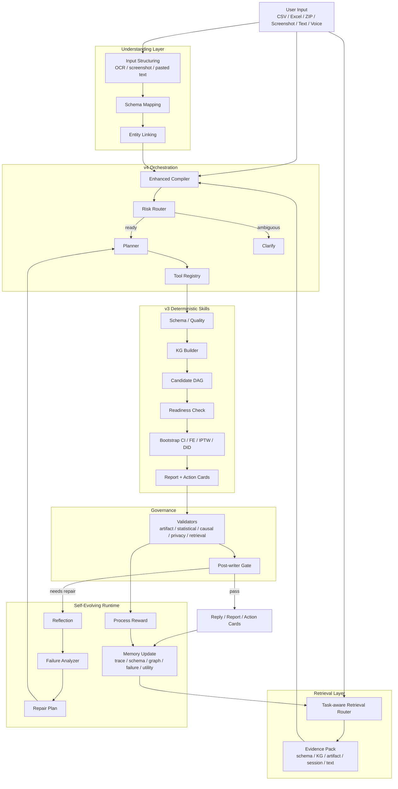

# SoloDeck v4 Agent Architecture

## 1. One-line summary

SoloDeck v4 is a session-aware business analysis agent layered on top of SoloDeck v3:

- **v3** provides the analysis engine: schema mapping, knowledge graph, causal estimation, validation, rewards, and action cards.
- **v4** adds the conversation runtime: multi-turn session memory, task planning, tool orchestration, context compression, risk routing, and pre-output gating.

In short:

```text
v3 = one-shot verified analysis engine
v4 = conversational orchestration layer around v3
```

## 2. Presentation-ready architecture flow

```text
User Input
  ├─ Structured files: CSV / Excel / ZIP
  ├─ Unstructured input: screenshots / OCR / pasted text / chat follow-up
  └─ Voice transcript
        ↓
Data Understanding Layer
  ├─ Schema mapping
  ├─ Entity linking
  ├─ Text normalization
  ├─ Knowledge graph construction
  └─ Candidate causal graph generation
        ↓
Task Orchestration Layer (v4)
  ├─ Session store
  ├─ Enhanced task compiler
  ├─ Risk router
  ├─ Task planner
  ├─ Tool registry
  └─ Context compressor
        ↓
Execution Layer (v3 + Python Skills)
  ├─ Retrieve memory
  ├─ Compile task
  ├─ Plan steps
  ├─ Execute analysis
  │    ├─ bootstrap confidence interval
  │    ├─ fixed-effects adjustment
  │    ├─ stratified effect estimation
  │    ├─ ATE / relative lift
  │    ├─ knowledge graph summary
  │    └─ candidate DAG reasoning
  ├─ Validate artifacts
  └─ Compose response
        ↓
Verification & Safety Layer
  ├─ data quality checks
  ├─ causal readiness checks
  ├─ trace validation
  ├─ claim review
  ├─ privacy validation
  └─ post-writer gate
        ↓
Output Layer
  ├─ action cards
  ├─ business reply
  ├─ diagnosis summary
  ├─ decision check
  ├─ graph/causal digest
  └─ weekly report
```

## 3. Current status

### Implemented

- v4 multi-turn session runtime
- task-aware retrieval and evidence pack
- enhanced compiler with follow-up context merge
- risk router with clarification / cache reuse / deep-path routing
- tool registry and ordered execution
- v3 deterministic analysis core
- knowledge graph as constraint memory, not causal truth
- candidate causal graph generation with optional libraries and rule fallback
- causal readiness checks
- bootstrap CI, fixed-effects adjustment, optional IPTW
- claim governance:
  - causal validator
  - retrieval evidence validator
  - post-writer gate
- repair loop:
  - reflection
  - failure classification
  - repair plan
- runtime memory updates:
  - schema memory
  - graph memory
  - trace memory
  - failure memory
  - skill utility memory
- process reward + agent-wise normalization

### Partially implemented

- self-evolving runtime:
  - yes at the workflow/policy/memory level
  - not yet as online parameter learning for the base LLM
- lightweight retrieval:
  - yes, with schema/KG/artifact/session/text routing
  - still relatively lightweight; not a full embedding-heavy RAG stack
- candidate DAG discovery:
  - optional `causal-learn` / `LiNGAM`
  - otherwise deterministic fallback
- voice:
  - backend wrapper exists
  - product-level voice UX is still lighter than the rest of the system

### Not fully there yet

- true online model learning or RL fine-tuning
- benchmark-grade synthetic SCM evaluation loop fully exposed as a first-class product surface
- stronger claim taxonomy in final user-facing UI
- richer retrieval source scoring and artifact lineage display for every end-user answer

## 4. Mermaid flowchart



## 5. Mind-map version

```text
SoloDeck v4
├─ Input
│  ├─ CSV / Excel / ZIP
│  ├─ Screenshot / OCR
│  ├─ Pasted text
│  └─ Voice transcript
├─ Understanding
│  ├─ Schema mapping
│  ├─ Entity linking
│  ├─ Knowledge graph
│  └─ Candidate causal graph
├─ Orchestration
│  ├─ Session store
│  ├─ Task compiler
│  ├─ Risk router
│  ├─ Planner
│  ├─ Tool registry
│  └─ Context compression
├─ Analysis
│  ├─ ATE / relative lift
│  ├─ Bootstrap CI
│  ├─ Fixed effects
│  ├─ Stratified effects
│  ├─ KG summary
│  └─ DAG evidence
├─ Verification
│  ├─ Data quality
│  ├─ Causal readiness
│  ├─ Trace validation
│  ├─ Claim review
│  ├─ Privacy checks
│  └─ Post-writer gate
└─ Output
   ├─ Action cards
   ├─ Chat reply
   ├─ Decision check
   ├─ Diagnosis
   └─ Weekly report
```

## 6. What v4 adds over v3

### v3

- Strong at **single-run analysis**
- Builds:
  - KG
  - candidate causal structure
  - causal readiness
  - bootstrap intervals
  - fixed-effects adjustments
  - validation reports
  - action cards

### v4

- Strong at **interactive analysis**
- Adds:
  - multi-turn conversation
  - session-level memory
  - context carry-over
  - risk-based routing
  - tool-by-tool orchestration
  - pre-output gating
  - voice-turn wrapper

## 7. Where self-evolution actually exists

SoloDeck already has a **runtime self-evolution layer**, but it is important to define it correctly.

It is **not**:

- online fine-tuning of the base LLM
- reinforcement learning that updates model weights live
- automatic discovery of true causal structure

It **is**:

- failure-aware reflection
- repair-loop execution
- process reward assignment
- agent-wise reward normalization
- skill utility memory updates
- future plan/routing bias based on prior successful traces

In plain language:

```text
SoloDeck learns at the workflow policy level, not at the foundation-model parameter level.
```

Code anchors:

- `solodeck_v3/workflows/data_agent_graph.py`
- `solodeck_v3/evolution/error_analyzer.py`
- `solodeck_v3/evolution/scheduler_update.py`
- `solodeck_v3/reward/process_reward.py`
- `solodeck_v3/reward/agent_wise_normalization.py`

## 8. The 7 v4 tools

```text
1. retrieve_memory
2. compile_task
3. plan_steps
4. execute_analysis
5. validate_artifacts
6. compose_response
7. clarify
```

### Their role

- `retrieve_memory`: load prior turns, linked entities, cached artifacts
- `compile_task`: convert user question into a task spec
- `plan_steps`: decompose the question into executable steps
- `execute_analysis`: call v3 workflows / Python skills
- `validate_artifacts`: check whether the outputs are safe and usable
- `compose_response`: translate artifacts into user-facing answer + actions
- `clarify`: ask follow-up when ambiguity is too high

## 9. How LangGraph fits in

LangGraph is not the whole system; it is the **workflow controller** inside the orchestration layer.

It manages:

- step sequencing
- retries / reflection-friendly execution
- tool invocation order
- memory-aware task continuation

So the system is better described as:

```text
Session Runtime + Task Compiler + LangGraph Workflow + Python Skills + Validators
```

not just:

```text
an LLM with LangGraph
```

## 10. How to explain this in a talk

Use this script:

> SoloDeck v4 is a verified business analysis agent for creators and solo companies.  
> The bottom half is a deterministic analysis engine: schema mapping, knowledge graph construction, causal estimation, bootstrap confidence intervals, fixed-effects adjustment, and validation.  
> The top half is a conversation runtime: it remembers prior turns, retrieves task-relevant evidence, compiles the next question into a task, routes the problem based on risk, executes tools in sequence, validates the result, and only then returns action cards.
> On top of that, it has a lightweight self-evolving loop: failed or risky runs trigger reflection, repair, reward updates, and memory updates that influence future routing.
> So instead of a one-shot dashboard, it behaves like a memory-enabled analyst that can be questioned, corrected, and continued across turns.
