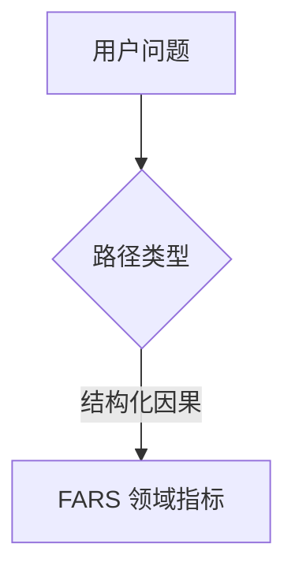
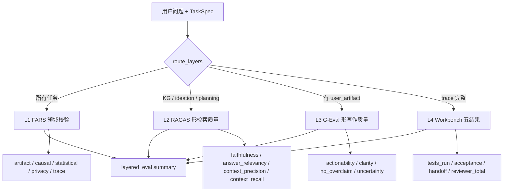

# SoloDeck v3 — Layered Evaluation

## 分层评估图怎么画

课程站点（如 [真实仓库上的工作台](https://aieng-zh.cn/lessons/14-agent-engineering/41-workbench-for-real-repos/)）里的图用 **Mermaid `flowchart TD`**（Top-Down）：

- **节点** = 模块或决策点（矩形）
- **箭头** = 数据/控制流向
- **`{菱形}`** = 分支判断（本项目的 `route_layers`）

在 Markdown 里直接写：

````markdown

````

Cursor / GitHub / 课程站点都会渲染成流程图。

## SoloDeck 四层评估



### 各层职责

| 层 | 对应课程/框架 | SoloDeck 实现 | 何时跑 |
|---|---|---|---|
| L1 FARS | 阶段 14·30 评估驱动开发 | `verification/*` + `bench/metrics.py` | **始终** |
| L2 RAGAS | RAG 评估四指标 | `bench/layered_eval.py` 启发式代理 | Retriever/KG 路径 |
| L3 G-Eval | DeepEval 自定义 rubric | `bench/layered_eval.py` 行动卡片规则 | Writer 产出后 |
| L4 Workbench | [41-workbench-for-real-repos](https://aieng-zh.cn/lessons/14-agent-engineering/41-workbench-for-real-repos/) | trace + validation + handoff | 完整 LangGraph  run |

### 运行

```bash
# 原有 FARS bench（不变）
python -m solodeck_v3.bench.benchmark_runner

# 新增：FARS + 分层评估（默认 6 条任务采样，加快 CI）
python -m solodeck_v3.bench.layered_eval_runner
```

### 与 RAGAS / DeepEval 的关系

- **不替换** L1 领域校验（数字、CI、因果过度声明）
- L2/L3 当前为 **stdlib 启发式**，零依赖、可复现
- 生产 CI 可将 L2 换为 `ragas`，L3 换为 `deepeval` 的 G-Eval，接口保持 `run_layered_eval(result)` 不变
