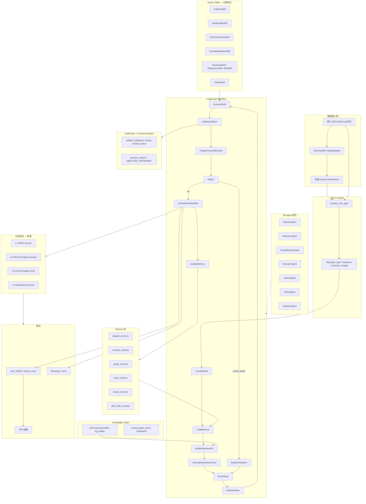
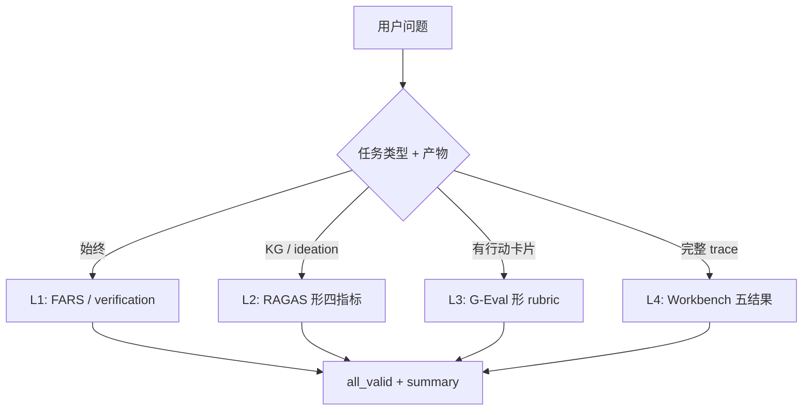
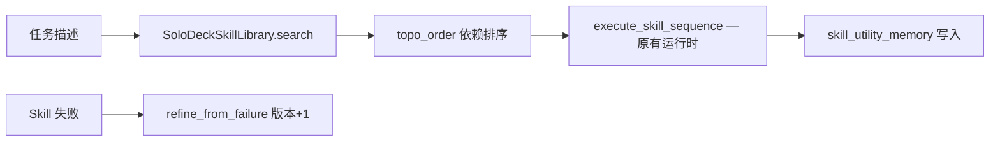
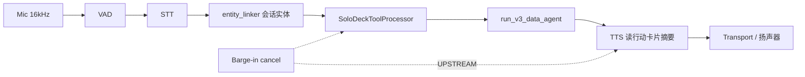
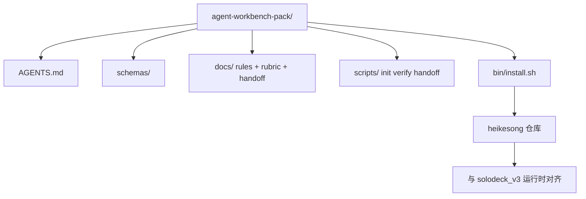

# SoloDeck v3 — System Map

Full architecture with evaluation layers, workbench surfaces, and optional voice I/O.

## 1. 端到端主链路

## 2. 分层评估路由（与 LAYERED_EVALUATION.md 一致）

## 3. Voyager 技能库（课程 10）— 适配层

实现：`solodeck_v3/runtime/skill_library.py`（**不修改** `skill_runtime.py` 行为）

## 4. 语音网关（课程 22）— 可选 I/O

实现：`solodeck_v3/voice/gateway.py`（**不修改** LangGraph 主图）

## 5. Agent Workbench 七接触面（课程 41 / 42）

## 6. 模块索引

| 路径 | 职责 |
|---|---|
| `solodeck_v3/compiler/` | TaskSpec 编译 |
| `solodeck_v3/router/` | 工具路由与预算 |
| `solodeck_v3/memory/` | 六类经营记忆 |
| `solodeck_v3/graph/` | KG + 因果约束 |
| `solodeck_v3/workflows/data_agent_graph.py` | LangGraph 主图 |
| `solodeck_v3/skills/` | 可验证 Python 计算 |
| `solodeck_v3/verification/` | 领域校验关卡 |
| `solodeck_v3/reward/` | Process reward |
| `solodeck_v3/bench/` | FARS + **layered_eval** |
| `solodeck_v3/runtime/skill_library.py` | Voyager 适配 |
| `solodeck_v3/nlp/entity_linker.py` | 业务实体链接（可选） |
| `solodeck_v3/voice/` | 语音流水线桩 |
| `agent-workbench-pack/` | 可安装工作台包 |
| `solo_creator_agent/api_spa.py` | FastAPI + SPA |

## 7. 课程对照 — 对本项目的帮助

| 课程 | 采纳方式 | 侵入性 |
|---|---|---|
| [41 真实仓库工作台](https://aieng-zh.cn/lessons/14-agent-engineering/41-workbench-for-real-repos/) | L4 五结果 + `agent-workbench-pack/` | 低：独立目录 |
| [10 Voyager 技能库](https://aieng-zh.cn/lessons/14-agent-engineering/10-skill-libraries-voyager/) | `skill_library.py` 包装现有 Skill | 低：不改编排 |
| [22 语音 Pipecat/LiveKit](https://aieng-zh.cn/lessons/14-agent-engineering/22-voice-agents-pipecat-livekit/) | `voice/gateway.py` 帧流水线 | 低：可选 API |
| [42 工作台包 capstone](https://aieng-zh.cn/lessons/14-agent-engineering/42-agent-workbench-capstone/) | `agent-workbench-pack/` 安装器 | 低：复制即用 |
